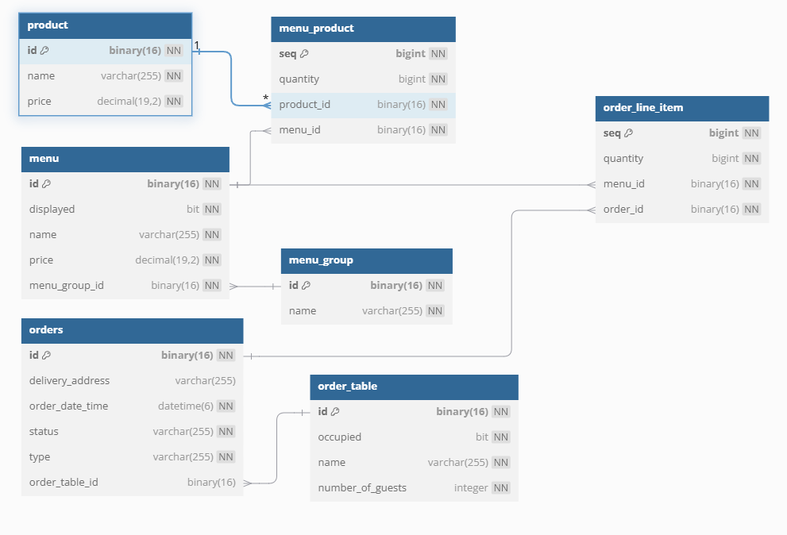

# 키친포스

## 퀵 스타트

```sh
cd docker
docker compose -p kitchenpos up -d
```

## 요구 사항
- 메뉴 그룹
    - [X]  새로운 메뉴 그룹 생성할 수 있다.
        - [X] 메뉴 그룹명은 비어있으면 안된다.
    - [X]  메뉴 그룹 전부 가져올 수 있다.
- 메뉴
    - [X]  새로운 메뉴 생성할 수 있다.
        - [X] 메뉴명은 비어있으면 안된다.
        - [X] 메뉴 가격은 0원 이상이여야 한다.
        - [X] 메뉴는 메뉴 그룹을 설정해줘야 한다.
        - [X] 메뉴 생성 시, 존재하는 상품이여야 한다.
        - [X] 메뉴의 상품들의 수량은 0개 이상이여야 한다.
        - [X] 메뉴의 가격은 메뉴 상품 가격의 총합 보다 높을 수 없다.
        - [X] 메뉴 이름은 비속어가 포함될 수 없다.
    - [X]  메뉴의 가격을 수정한다.
        - [X] 변경될 가격은 0원 이상이여야 한다.
        - [X] 메뉴의 가격은 메뉴 상품 가격의 총합 보다 높을 수 없다.
    - [x]  메뉴 전시 상태 ON 하기
        - [X] 메뉴의 가격은 메뉴 상품 가격의 총합 보다 높을 수 없다.
    - [X]  메뉴 전시 상태 OFF 하기
    - [X]  메뉴 전부 가져올 수 있다.
- 메뉴 상품
    - [X] 메뉴를 구성하는 상품이다.
         - [X] 상품 정보와 개수를 가진다. 
         - [X] 메뉴 상품은 0개 이상의 개수를 가진다. 
- 가게 테이블
    - [X]  가게 테이블 생성할 수 있다.
          - [X] 가게 테이블명은 비어있을 수 없다.
    - [ ]  테이블 앉히기
    - [ ]  테이블 정리
          - [ ] 테이블을 정리하기 위해서는 주문이 완료여야 한다.
    - [ ]  테이블 고객수 변경하기
          - [ ] 변경할 인원 수는 0명 이상이어야 한다.
          - [ ] 사용 가능한 테이블만 인원 수를 변경 할 수 있다.
    - [ ]  가게 테이블 전부 가져오기.
- 주문
    - [ ]  주문 생성할 수 있다.
          - [ ] 공통 확인 사항
              - [ ] 주문 타입이 비어있으면 안된다.
              - [ ] 주문 내역에 메뉴들은 존재하는 메뉴들이어야 한다.
              - [ ] 주문 내역이 비어있으면 안된다.
              - [ ] 주문 내역의 메뉴는 전시 상태여야 한다.
              - [ ] 주문 내역의 가격과 메뉴의 가격이 동일해야 한다.
          - [ ] 배달 주문을 생성 한다.
              - [ ] 주문 내역의 개수가 0개 이상이여야 한다.
              - [ ] 주소가 적혀 있어야 한다.
          - [ ] 매장 주문을 생성 한다.
              - [ ] 주문 내역의 개수가 0개 이상이여야 한다.
              - [ ] 사용 가능한 테이블이 있어야 함.
          - [ ] 포장 주문을 생성 한다.
    - [ ]  주문 받기.
          - [ ] 주문 상태가 대기중일 경우에 수락 가능하다.
          - [ ] 배달 주문은 배달을 요청한다.
    - [ ]  주문을 조리 완료하여 서빙 상태로 변경하기.
          - [ ] 주문 상태가 수락일 경우에 서빙 가능하다.
    - [ ]  배달 시작하기
          - [ ] 주문 상태가 서빙 상태여야 배달 시작 가능하다.
          - [ ] 주문 타입이 배달이여야 한다.
    - [ ]  배달 완료하기.
          - [ ] 주문 상태가 배달중 상태여야 배달 완료 가능하다.
    - [ ]  주문 완료하기.
          - [ ] 배달 이외 주문 완료
             - [ ] 서빙 상태여야 주문 완료 가능하다.
             - [ ] 매장 주문은 테이블 정리를 추가로 진행한다.
          - [ ] 배달 주문 완료
             - [ ] 배달 완료 상태여야 주문 완료 가능
    - [ ]  주문 정보를 전부 가져올 수 있다.
- 상품
    - [ ]  상품을 생성할 수 있다.
        - [ ] 상품의 가격은 0원 이상이여야 한다.
        - [ ] 상품의 이름은 비속어가 포함될 수 없다.
    - [ ]  상품의 가격을 수정하기.
        - [ ] 변경 가격은 0원 이상이여야 한다.
        - [ ] 가격 변경 후, 변경된 상품이 속한 메뉴의 가격이 총 합(상품 * 개수) 높다면 메뉴를 비전시로 변경된다.
    - [ ]  상품 정보를 전부 가져올 수 있다.
## 용어 사전

| 테이블    | 영문명 | 설명                                                             |
|--------| --- |----------------------------------------------------------------|
| 메뉴     | menu  | 메뉴 정보(노출 여부, 이름, 가격), 메뉴그룹(menu_group), 메뉴상품(menu_product) 리스트 |
| 메뉴 그룹  | menu_group  | 메뉴를 그룹화하여 명칭 부여 ex) 추천메뉴                                       |
| 메뉴 상품  | menu_product  | 메뉴 상품 정보(수량, 상품ID, 메뉴ID), (상품 * 수량)                            |
| 주문 내역  | order_line_item  | 수량, 메뉴ID, 주문ID                                                 |
| 가게 테이블 | order_table  | 가게 테이블. 이름, 고객 수, 가득참 여부                                       |
| 주문     | orders  | 주문 정보(배달 주소, 주문 시각, 상태, 타입)                                    |
| 상품     | product  | 상품 정보(이름, 단일 가격)                                               |


| Enum 정의 | 영문명 | 설명 |
|---------| --- | --- |
| 주문 상태   | OrderStatus  | WAITING, ACCEPTED, SERVED, DELIVERING, DELIVERED, COMPLETED  |
| 주문 타입   | OrderType  | DELIVERY, TAKEOUT, EAT_IN  |

## 모델링

